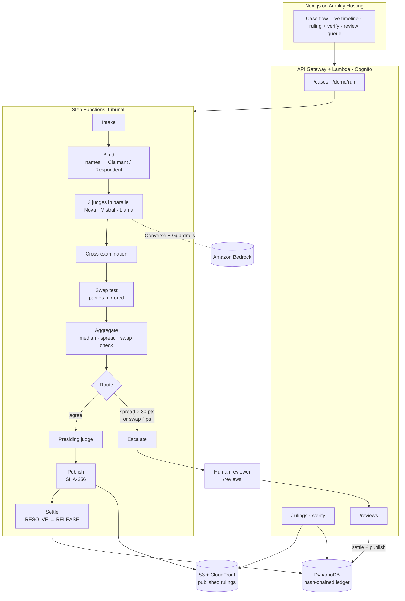

# Panch

**The AI panchayat for disputes no court will hear.** Built for the AWS Zero to Shipped hackathon · `#commercial-potential` · `#startup`

**Live:** https://main.d1hm3x5hny8fjb.amplifyapp.com. No login is needed for the landing page, **Run demo case** or the public rulings.

## In 30 seconds

A freelancer in Mumbai finishes $400 of work for a client in Berlin, and the client stops paying. A lawyer costs more than the claim and a foreign court won't hear it. Panch is consent-based arbitration for these small cross-border disputes:
- Both sides agree to Panch when they make the deal, and the client funds a simulated escrow.
- In a dispute, three judges from three model families (Amazon Nova, Mistral and Llama on Bedrock) rule independently on a record with names and countries removed. They then cross-examine each other.
- A swap test mirrors the parties to catch label bias.
- When the judges agree, a presiding judge publishes a reasoned ruling: every finding cites evidence, and its hash and escrow ledger can be verified by anyone.
- When they don't agree, a human decides from the full panel record.

Measured cost: about **$0.03 per case**.

## Try it

| What | Where |
|---|---|
| Run a pre-seeded case through the real tribunal and watch the live timeline | Landing page → **Run demo case** |
| A published ruling, with **Verify ruling** (recomputes the content hash and the ledger chain) | [Case A ruling](https://main.d1hm3x5hny8fjb.amplifyapp.com/ruling/?id=demo-ba-a-354484) |
| The full flow: create a case, fund, dispute, upload evidence, submit | Sign up (email), then **My cases → New case** |
| The human review queue for escalated cases | Sign in → **Reviews** |
| What Panch does not do yet | [Limitations](https://main.d1hm3x5hny8fjb.amplifyapp.com/limitations/) |

## How it works



**Bias controls:**
- Judges never see names, countries or platforms.
- Every judge output is validated against a JSON schema, and findings without an evidence ID are dropped.
- The swap test reruns every judge with the parties mirrored.
- A panel spread above 30 points, or a swap test that flips the winner, sends the case to a human instead of publishing.

## Measured cost per case

These figures come from the Rulings records on the live stack (LOG.md phase 21):

| Rulings measured | Median | Mean | Range |
|---|---|---|---|
| 13 | $0.0261 | $0.0294 | $0.0245 to $0.0419 |

That is about 12 Bedrock calls and 9,000 to 15,000 tokens per case, against the PRD's target of under $1. Total AWS spend for the project at the time of measurement was $1.15.

## Bias and accuracy, reported honestly

- **Benchmark results: unmeasured, and that's stated.** [`bench/RESULTS.md`](./bench/RESULTS.md) marks every PRD section 9 metric (agreement with gold, escalation on ambiguous cases, swap-test flip rate) as **UNMEASURED**. Since 2026-09-29, Bedrock model access has been blocked at the account level ("Error 002"), so no panel could run. The one result it confirms live is the failure path: a failed run publishes the labelled fallback and leaves the escrow untouched.
- **Live tribunal status:** until model access is restored, every **Run demo case** ends in that fallback. The site says so plainly rather than showing a fake ruling.
- **Last measured live (2026-09-28, before the block):** the three hand-written demo cases were run on the live stack against gold labels fixed beforehand (LOG.md phase 16):
  - **Case A:** matched at 100%.
  - **Case B:** matched at 0%, but only after a swap-test prompt fix. Before the fix it escalated twice.
  - **Case C:** a genuine split; it escalated, as designed.
- **Known weaknesses:**
  - Run-to-run variance, mostly from the Nova judge. About 40% of demo runs have escalated.
  - A median-blind panel swap check.
  - Positional bias under the mirrored-roles prompt.
- Details and the full table are in [`docs/submission/builder-center.md`](./docs/submission/builder-center.md).

## Synthetic data

Every contract, chat log, invoice, party and benchmark case in this repo and on the live site was written for testing. No real people, businesses or disputes are used. Panch is arbitration by consent on **simulated** funds, and nothing here is legal advice.

## Limitations

The site's [Limitations page](https://main.d1hm3x5hny8fjb.amplifyapp.com/limitations/) lists the known gaps in plain language:
- the escrow is simulated;
- there is no appeal window;
- a silent respondent is not timed out;
- any signed-in account can review;
- judges vary from run to run;
- the swap test has blind spots;
- cases have no written summary field.

Security notes are in [`docs/SECURITY.md`](./docs/SECURITY.md).

## Development process and the coding agent

- **Specs and contracts:** the work followed the PRD and TRD, with frozen contracts in `services/shared` between three lanes (see [`docs/TEAM_PLAN.md`](./docs/TEAM_PLAN.md)).
- **Pull requests:** everything landed through PRs from the repo template, each with tests, `cdk synth` and a dev-log entry.
- **The dev log:** [`docs/dev-process/LOG.md`](./docs/dev-process/LOG.md) records each phase: what was built, **what the coding agent did**, the checks run, the bugs found live, and what was deliberately left open.
- **The coding agents** (Claude Code, and Codebuff for some tribunal work) worked through the team's AWS SSO profile:
  - they built and deployed the CDK stacks;
  - they wrote the API, tribunal and frontend code and tests;
  - they ran the live verification passes that caught bugs only visible on the deployed stack. Examples: double settlement, a swap-test prompt that flagged unanimous panels, an IAM grant on the wrong ARN, and a fallback shown as if it were a ruling.
- **Proof** of the agent connected to AWS: [`docs/dev-process/proof/`](./docs/dev-process/proof/). Today it holds one screenshot of the SSO identity check; the agent-session screenshots and the screen recording are still to be added (LOG.md phase 24).

## Setup from a clean checkout

You need Node.js 20 (`.nvmrc`). AWS access is only needed to deploy, not to build or test.

```bash
git clone https://github.com/ArshvirSk/PANCH.git && cd PANCH
nvm use                      # Node 20
npm ci                       # all workspaces
npm run lint
npm run typecheck
npm test                     # api, tribunal, shared and web suites
npm run synth                # CDK synth of all six stacks, no AWS credentials needed

# Frontend against the live API
cp web/.env.example web/.env.local   # API URL, Cognito pool ID and app client ID
npm run dev --workspace=web          # http://localhost:3000
```

**Deploying** needs the `panch` SSO profile (`aws sso login --profile panch`, account `890742603792`, `us-east-1`), and goes through `scripts/require-deploy-lock.sh`. See [`docs/DEV_SETUP.md`](./docs/DEV_SETUP.md).

---

## Team notes

### 📚 Essential Reading
Before writing any code or prompting your agents, please ensure they read these specs:
- [`AGENTS.md`](./AGENTS.md) - The master ruleset for all AI agents working on this repo.
- [`docs/Panch_PRD.md`](./docs/Panch_PRD.md) - Product requirements and feature scope.
- [`docs/Panch_TRD.md`](./docs/Panch_TRD.md) - Technical architecture, schemas, and AWS stack details.
- [`docs/TEAM_PLAN.md`](./docs/TEAM_PLAN.md) - Roles, phases, and workflows.

---

## 🚀 Setup & Local Development

This is an `npm` workspaces monorepo containing our CDK Infrastructure, Backend APIs, AI Workflow, and Next.js Frontend.

1. **Install dependencies:**
   ```bash
   nvm use 20  # or fnm use 20
   npm install
   ```
2. **AWS Credentials:**
   Ensure you are logged into AWS SSO with the `panch` profile (Account `890742603792`, Region `us-east-1`).
   ```bash
   aws sso login --profile panch
   ```

---

## 🏗️ Phase 1 / 2 Infrastructure (Completed)

The foundational Data, Auth, and API stacks are **live and fully integrated**.

**Live Endpoints:**
- **API URL:** `https://y05rlxj2c1.execute-api.us-east-1.amazonaws.com/prod/`
- **Cognito User Pool ID:** `us-east-1_1MJKFFcNn`
- **Cognito Client ID:** Stored in SSM parameter `/panch/auth/userPoolClientId`
- **DynamoDB Tables & S3 Bucket Names:** Stored in SSM (e.g. `/panch/data/tables/cases`, `/panch/data/buckets/evidence`)

---

## ☁️ AWS Services Actually Used

Every service below is created by a CDK stack in `infra/lib/` and exercised by the deployed system (verified Day 3). Nothing on this list is aspirational; Textract was planned in the TRD but is **not** used — evidence text extraction is seeded/uploaded directly.

| Service | Where | Used for |
|---|---|---|
| Lambda (Node.js 20) | ApiStack, WorkflowStack, DataStack | All API handlers, tribunal tasks, evidence processing |
| API Gateway (REST) | ApiStack | Public + Cognito-authorised HTTP API |
| Step Functions (Standard) | WorkflowStack | Tribunal state machine: judges → cross-exam → swap test → aggregate → publish → settle, with Retry/Catch |
| Amazon Bedrock | WorkflowStack | Three judges from three model families (Nova Pro, Mistral Large, Llama 3.3 70B) via Converse |
| Bedrock Guardrails | WorkflowStack | Content policy applied on every judge call (guardrailConfig on Converse) |
| DynamoDB (on-demand) | DataStack | Cases, Ledger (hash-chained, transactional), Evidence, Rulings (cost records) |
| S3 (SSE-KMS) | DataStack | Evidence + benchmark buckets (private, KMS) |
| S3 + CloudFront (OAC) | DataStack | Public rulings path — private bucket, CloudFront-only origin access |
| AWS KMS | DataStack | Encryption keys for S3 buckets |
| Cognito | AuthStack | Sign-up/sign-in; ID-token verification on protected reads |
| Amplify Hosting | WebStack | Next.js static frontend builds |
| CloudWatch | ObsStack | Dashboard (`Panch-Demo`), 3 alarms (failed executions, API 5xx, Bedrock throttles), EMF custom metrics (tokens, demo runs, review actions, stage durations) |
| X-Ray | ApiStack, WorkflowStack, DataStack | Tracing on all Lambdas, the state machine, and API Gateway |
| SNS | ObsStack | Alarm topic (`panch-alarms`) |
| SSM Parameter Store | AuthStack, WorkflowStack | Model IDs/modes, table/bucket names, Cognito IDs, per-1k-token Bedrock pricing (`/panch/pricing/bedrock/*`) |
| Secrets Manager | WebStack | Amplify build GitHub token |

---

## 🧑‍💻 Handover: Frontend (Piyush)

Your goal is to build out the Next.js `web/` application and wire it to the real APIs.

### Auth & Connection
1. Initialize AWS Amplify Auth in the Next.js app using the Cognito User Pool ID and Client ID. 
2. Users can sign up via Email.
3. Every call to the protected API routes must include the Cognito `IdToken` in the `Authorization` header.

### Case Workflow Integration
The case progression is managed through REST API endpoints. You no longer need the mock server!

1. **Create Case (Claimant):**
   - `POST /cases`
   - Body: `{ "amountCents": 5000, "respondentEmail": "bob@example.com", "currency": "USD" }`
   - Returns: `201 Created` with `{ caseId: "...", status: "CREATED" }`
2. **Fund Case (Respondent):**
   - `POST /cases/{id}/fund`
   - Transitions case to `FUNDED`.
3. **Dispute Case:**
   - `POST /cases/{id}/dispute`
   - Transitions case to `DISPUTED`.
4. **Upload Evidence:**
   - `POST /cases/{id}/evidence`
   - Request a presigned URL. Returns an `evidenceId` and an S3 PUT `uploadUrl`.
   - **Upload File:** Simply do a `PUT` request to `uploadUrl` with the file blob.
   - **Note:** The backend automatically computes the file's SHA-256 hash asynchronously via an S3 event and stores it in the `Evidence` DynamoDB table! You do not need to calculate or submit hashes from the frontend.
5. **Submit for Deliberation:**
   - `POST /cases/{id}/submit`
   - Transitions case to `DELIBERATING` and locks further uploads. (This will soon trigger the AI Step Functions).

### Public Routes
- **Health Check:** `GET /health` (Returns `{ status: "ok", timestamp: "..." }`)
- **Demo Mode:** `POST /demo/run` (Triggers a quick, unauthenticated demo simulation).

### Frontend status (built)

The `web/` app covers everything above. It is a Next.js static export, hosted by the Amplify app in `WebStack`.

| Page | Login | What it does |
|---|---|---|
| `/` | No | Landing page, **Run demo case** (`POST /demo/run`) with the live tribunal timeline (public `GET /cases/{id}` for demo cases), API health in the footer (`GET /health`) |
| `/login/` | No | Sign in, create account (email), confirm the emailed code. Uses `USER_PASSWORD_AUTH`, the only flow the Cognito app client enables |
| `/cases/` | Yes | Cases opened on this device (the API has no list route yet), with statuses refreshed from the API; open a case by ID or pasted link |
| `/cases/new/` | Yes | Create a case as claimant (`POST /cases`) |
| `/case/?id=` | Yes | Fund as respondent, dispute, upload evidence (drag and drop, presigned S3 PUT), submit, live polling while deliberating, ledger receipts. Fund, dispute and submit ask for confirmation |
| `/ruling/?id=` | No | Public ruling as a formal award: split, confidence, reasoning (model markdown rendered safely), cited findings, clauses (`GET /rulings/{id}`), and **Verify ruling** (`GET /rulings/{id}/verify`: content hash and ledger chain, failures shown with the server's reason). Human-reviewed rulings say a reviewer decided; a failed demo's cached fallback is labelled *not a ruling* and shows no award |
| `/reviews/` | Yes | Human review queue for escalated cases: summary, amount, the three judges side by side, spread, swap test, and a form to settle the case (`GET /reviews`, `POST /reviews/{caseId}`) |
| `/limitations/` | No | Known gaps in plain language, linked from the footer |

Every protected call sends the Cognito ID token in `Authorization`. Roles come from the case: the claimant is the creator's Cognito `sub`, and the respondent is the account whose email matches `respondentEmail`.

**Human review queue (`/reviews/`, TEAM_PLAN section H):**
- **Scope cut, stated plainly:** any signed-in account can act as the reviewer. There is no reviewer role or invite flow. The page warns a reviewer who is a party to the case.
- **Oldest case first.** Each case shows:
  - the summary, amount and escalation reason;
  - the panel median, spread and swap-test verdict;
  - each judge's award, confidence, reasoning, cited findings, clauses and uncertainties, side by side.
- **Per-judge swap check:** the page maps each swap run back (`10000 − swap award`) and marks a judge *Flipped* when the winner changes sides. The panel's `swapConsistent` compares medians, so this per-judge flag is how a reviewer sees the median-blind case described in LOG.md phase 10.
- **Blind review:** party names and emails are never shown, the same as for the judges.
- **The decision form:**
  - The reviewer enters the claimant's share as a percentage (sent as `payeeShareBps`) and a required note of up to 1,000 characters.
  - Quick-fill buttons offer the median, each judge's award and an even split, with a live money split.
  - A confirmation step comes before `POST /reviews/{caseId}` with `{ payeeShareBps, note }`.
  - If another reviewer settled the case first (400 `Case must be ESCALATED`), the page says so and refreshes the queue.
- **Accepted `GET /reviews` shapes:** a list, or `{ items | reviews | cases: [...] }`. Each item is a Cases item with the panel record under `panelOutputs` or at the top level:
  - **Judges:** `judges`, or `finalPanelOutputs` (array, `{ judgeName, output }` task results, or keyed by judge name).
  - **Swap runs:** `swapOutputs`.
  - **Panel values:** `spreadBps`, `medianPayeeShareBps`, `swapConsistent` and `escalationReason`, flat or under `aggregate`.
  - **Summary:** `summary` or `caseSummary`.
  - **Missing parts:** the page says so instead of guessing.

**Reliability and security:**
- API calls time out after 20 s and uploads after 120 s.
- Reads are retried once on a network error or a 502/503/504. Writes are never retried.
- Server errors are shown without internal details.
- Double submits are blocked.
- The site sends a CSP and other security headers from `web/security-headers.json`, applied by `WebStack`.

**Tests:**
- `npm run test --workspace=web` runs 476 unit and component tests (Vitest, Testing Library, jsdom). They cover:
  - every case status for each role;
  - the dialogs, polling, uploads and login;
  - every accepted review-queue shape, the swap-test maths and the review form;
  - the live response shapes: `currentStage` mapped onto the timeline, `/verify`, the cached fallback, the demo daily cap;
  - hostile input.
- Two browser suites pass in Chrome and Edge: 95 checks for the case flow and 65 for the review queue. They live outside the repo; see `docs/dev-process/LOG.md`. They cover:
  - accessibility (axe, WCAG 2.1 AA, light and dark) and keyboard use;
  - offline and failing APIs, conflicting edits and two reviewers racing;
  - XSS, mobile layout, performance budgets and zero CSP violations.

**Run locally:**
```bash
cp web/.env.example web/.env.local   # fill in the API URL and Cognito IDs
npm run dev --workspace=web          # http://localhost:3000
npm run build --workspace=web        # static site in web/out
```

**Deploying:** Arshvir deploys after merging to `main`; the Amplify build of `main` publishes the site (`PanchWebStack.WebUrl`, today https://main.d1hm3x5hny8fjb.amplifyapp.com). The Amplify app gets `NEXT_PUBLIC_API_URL`, `NEXT_PUBLIC_USER_POOL_ID` and `NEXT_PUBLIC_USER_POOL_CLIENT_ID` from the stacks and builds with `/amplify.yml`.

---

## 🤖 Handover: AI & Workflows (Rutu)

Your goal is to implement the Step Functions orchestration and the judge logic under `services/tribunal/`.

### Bedrock & Model Configuration
- Do **NOT** hardcode model IDs in your Lambda code.
- Models for each judge role are defined in AWS SSM Parameters (e.g., `/panch/models/judge-1`, `/panch/models/judge-1-mode`).
- **Helper Available:** Use the `invokeJudgeModel` helper in `services/shared/helpers.ts`. It will automatically fetch the correct model ID from SSM, parse the mode (`json` vs `tool`), and securely invoke Amazon Bedrock.

### Step Function Schemas
The exact input/output boundaries for the Step Functions are frozen in `services/shared/step-functions.ts`. 

Your next steps:
1. Build the Lambda functions for the tribunal (e.g. `IntakeHandler`, `JudgeHandler`, `PresidingHandler`) in `services/tribunal/`.
2. Update `WorkflowStack.ts` to construct the Step Function state machine using these Lambdas.
3. Validate the inputs and enforce structured JSON outputs using the Zod schemas from `services/shared/schemas.ts`.
4. Keep token counts and costs logged per case!

---

## 🛠️ Testing & Verification
You can run the full E2E Integration script at any time to verify the API, Ledger hashes, Auth, and S3 event triggers are working correctly.

```bash
# Run the integration test (requires API_URL and AWS Profile)
$env:AWS_PROFILE="panch"
$env:AWS_REGION="us-east-1"
npx tsx scripts/integration.ts
```
