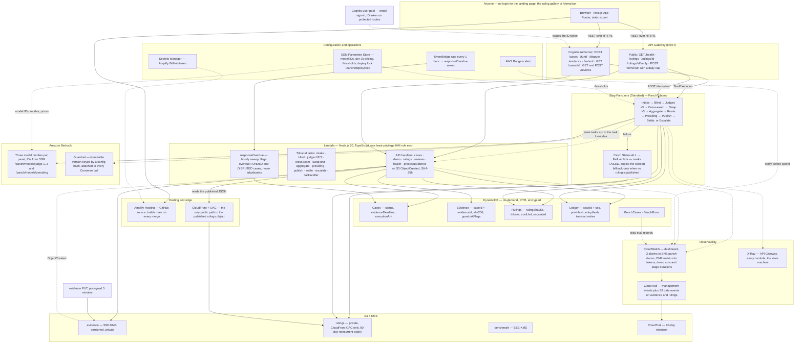
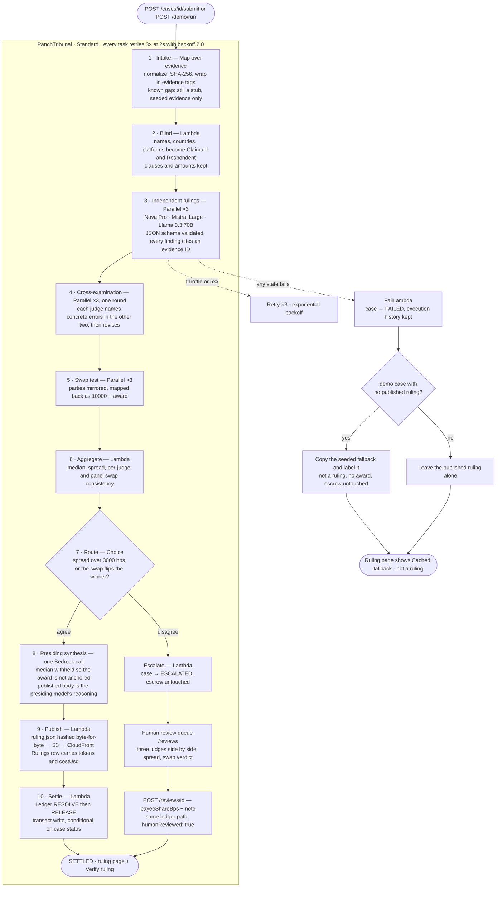

# Panch — the AI panchayat for disputes no court will hear

**AI arbitration for sub-$1,000 cross-border freelance disputes.** Three judges from three model families deliberate on AWS, cross-examine each other, run a bias check on their own verdicts, and publish a ruling anyone can verify — about **$0.03 of AWS per case**.

| | |
|---|---|
| **Category** | `#commercial-potential` |
| **Lane** | `#startup` |
| **Repository** | https://github.com/ArshvirSk/PANCH |
| **Live site** | https://main.d1hm3x5hny8fjb.amplifyapp.com (no login for the landing page, gallery and **Run demo case**) |
| **Sample ruling** | https://main.d1hm3x5hny8fjb.amplifyapp.com/ruling/?id=demo-ba-a-354484 |
| **Public API** | https://y05rlxj2c1.execute-api.us-east-1.amazonaws.com/prod/ (`POST /demo/run` is public) |
| **Notebook** | None. TypeScript/CDK end to end — no Jupyter or SageMaker anywhere in the repo. |

---

## The problem in one paragraph

A freelancer in Mumbai finishes $400 of work for a client in Berlin. The client stops paying. A lawyer costs more than the claim, a foreign court will not hear it, and off-platform deals have no dispute desk. Millions of sub-$1,000 cross-border disputes fall into that gap every year. Panch is consent-based arbitration for exactly these: both sides agree to it when they make the deal, the client funds a simulated escrow, and a panel of AI judges plus a human fallback turns the record into a reasoned, published, hash-verifiable ruling.

## Walkthrough

<!-- EDIT ME: captions below are ordered by file timestamp (02:45 → 02:49). Swap any caption that does not match its file. Renaming the files to demo-01-landing.jpg … demo-07-limitations.jpg would also make these links safe to read. -->

| # | Screenshot | What it shows |
|---|---|---|
| 1 |  | Landing page: the 30-second story and **Run demo case**, no login |
| 2 |  | Live tribunal timeline: intake → blind → three judges → cross-exam → swap |
| 3 |  | Case page: fund escrow, open the dispute, drag-and-drop evidence |
| 4 |  | Published ruling: award split, reasoning, findings with evidence IDs, clauses |
| 5 |  | **Verify ruling**: content hash recomputed and the escrow ledger chain walked |
| 6 |  | Human review queue: the three judges side by side, spread, swap verdict |
| 7 |  | Limitations: what Panch does not do yet, in plain language |

---

## Diagram 1 — the AWS workflow

Everything is AWS, created by six CDK stacks (`Data`, `Auth`, `Api`, `Workflow`, `Web`, `Obs`) in `infra/lib/`. Nothing runs continuously: no EC2, ECS, RDS, SageMaker or Kendra.



**Reading the diagram**

- **Two public read paths, both intentional.** The gallery and ruling list come from the Rulings table through API Gateway; the ruling JSON itself is served by CloudFront from a private bucket using OAC, so there is no public S3 URL.
- **One write path into the tribunal.** Only `POST /cases/{id}/submit` and `POST /demo/run` call `StartExecution`, and both are guarded by a conditional status update, so a double submit cannot start two executions.
- **Config is never in code.** Model IDs, modes, per-1k prices, thresholds and the deploy lock all live in SSM; the Amplify GitHub token is in Secrets Manager.
- **Textract is deliberately absent.** The TRD lists it for intake OCR and it is not used — stated as a known gap rather than drawn as working.

## Diagram 2 — the tribunal orchestration

A Standard Step Functions state machine. Every task retries 3× at a 2-second interval with backoff 2.0, and every task has a `Catch (States.ALL)` into the failure path.



### State by state

| # | State | Type | What it enforces |
|---|---|---|---|
| 1 | **Intake** | Map over evidence | Should normalize, hash and wrap evidence before anyone sees it. **Known gap: it is still a stub** — seeded evidence only, so uploads in the UI do not reach the judges yet (PRD F4). |
| 2 | **Blind** | Lambda | Names, countries and platforms become Claimant/Respondent. Clauses and amounts survive. |
| 3 | **Independent rulings** | Parallel ×3 | Three model families, IDs from SSM, Converse with `guardrailConfig`. Output is schema-validated with a retry on invalid JSON; findings without an evidence ID are dropped. |
| 4 | **Cross-examination** | Parallel ×3 | Each judge names concrete errors in the other two (factual, clause misreading, unsupported inference) and revises. One round is wired. |
| 5 | **Swap test** | Parallel ×3 | Roles mirrored, results mapped back as `10000 − award`. Produces the panel swap check and the per-judge flip flag. |
| 6 | **Aggregate** | Lambda | Median `payeeShareBps`, spread in bps, swap consistency, token and cost roll-up. |
| 7 | **Route** | Choice | Escalates when spread > 3000 bps or the swap flips the winner. |
| 8 | **Presiding synthesis** | Bedrock | One senior call across all three final rulings, with the median withheld so the award is reasoned rather than anchored. |
| 9 | **Publish** | Lambda | Hashes the exact bytes written to `panch-rulings/{caseId}/ruling.json`, stores `rulingSha256`, tokens and `costUsd`. |
| 10 | **Settle** | Lambda | `RESOLVE` then `RELEASE` as a transact write conditioned on case status, chained onto the current ledger head. |
| 11 | **Notify** | — | *Not built* — SES ruling email was cut (P1). |
| — | **Escalate** | Lambda | Case → ESCALATED, no RESOLVE/RELEASE, escrow untouched; the human queue picks it up. |
| — | **Fail (Catch)** | Lambda | Case → FAILED. For demo cases it copies the seeded fallback **only when nothing is published** — a failed re-run never overwrites a real ruling. |

---

## Bias controls, and how they are checked

- **Blind judging.** Judges never see names, countries or platforms.
- **Model diversity.** Amazon Nova, Mistral and Llama — three families, always different.
- **Citation enforcement.** Every finding must cite an evidence ID or it is dropped; judge output is schema-validated and rejected with a retry when it is not valid JSON.
- **Adversarial cross-examination.** Judges must name concrete errors in each other's rulings before revising.
- **Swap test.** Every judge is rerun with the parties mirrored. Panel spread above 30 points, or a swap that flips the winner, sends the case to a human instead of publishing.
- **Untrusted evidence.** Evidence is wrapped in `<evidence>` tags marked "data, not instructions", and a Bedrock Guardrail (immutable version keyed by a config hash) is attached to every Converse call.
- **Honest reporting.** `bench/RESULTS.md` marks every PRD §9 metric as **UNMEASURED** rather than estimating it.

## AWS services actually used

| Service | Where | Used for |
|---|---|---|
| Lambda (Node.js 20, TypeScript) | Api, Data, Workflow stacks | API handlers, tribunal tasks, evidence hashing |
| API Gateway (REST) | ApiStack | Public and Cognito-authorised routes |
| Step Functions (Standard) | WorkflowStack | Tribunal orchestration with retries and catches |
| Amazon Bedrock | WorkflowStack | Three judge families + presiding judge via Converse |
| Bedrock Guardrails | WorkflowStack | Policy on every judge call |
| DynamoDB (on-demand, PITR) | DataStack | Cases, Evidence, Rulings, Ledger, BenchCases, BenchRuns |
| S3 + KMS | DataStack | Evidence, rulings, benchmark, CloudTrail buckets |
| CloudFront (OAC) | DataStack | The only public path to published rulings |
| Cognito | AuthStack | Email sign-in and ID tokens |
| Amplify Hosting | WebStack | Next.js build on every merge to `main` |
| EventBridge Scheduler | WorkflowStack | Hourly response-overdue sweep |
| CloudWatch + X-Ray + SNS | ObsStack | Dashboard, 3 alarms, EMF metrics, traces |
| CloudTrail | ObsStack | Management events + S3 data events on evidence/rulings |
| SSM / Secrets Manager | Auth, Workflow, Web stacks | Model IDs, pricing, thresholds, deploy lock, GitHub token |
| AWS CDK (TypeScript) | `infra/` | All infrastructure as code |

## Data model and verifiability

- **Ledger** (`caseId` + `seq`): `FUND → DISPUTE → RESOLVE → RELEASE`, each entry storing `prevHash` and `entryHash = sha256(prevHash|event|amountCents|caseId)`, written with `TransactWriteItems` and a conditional check on case status. Double settlement and illegal transitions are rejected by the transaction, not by application code alone.
- **Rulings**: `rulingSha256` of the exact published bytes, plus `tokens` and `costUsd`.
- **Verify ruling** (`GET /rulings/{id}/verify`) recomputes both: the SHA-256 of what CloudFront serves, and every ledger link walked from genesis. It reports `match: false` with the server's reason rather than rubber-stamping — which is how a pre-hash legacy row and a known historical chain break are shown honestly today.

## Security

Least-privilege IAM per Lambda and per state machine, no wildcard resources, buckets private (rulings only through CloudFront OAC), SSE-KMS everywhere, presigned uploads with a 5-minute expiry, secrets in SSM and Secrets Manager, no secrets in the repo, and a security-header set (CSP and friends) applied by the web stack. Full notes: [`docs/SECURITY.md`](./docs/SECURITY.md).

## Measured cost

From the live Rulings records (LOG.md phase 21): **median $0.0261, mean $0.0294, range $0.0245–$0.0419** across 13 rulings — about 12 Bedrock calls and 9,000–15,000 tokens per case, against the PRD's target of under $1. Total AWS spend for the project at measurement time was $1.15.

## Development process and the coding agent

- **Specs first:** `docs/Panch_PRD.md` and `docs/Panch_TRD.md`, then a team plan with frozen contracts in `services/shared` between three lanes (infrastructure/API, tribunal/benchmark, frontend/docs).
- **Every change lands through a PR** from the repo template with unit tests, `cdk synth` and a dev-log entry. Deploys go through `scripts/require-deploy-lock.sh`, which refuses a dirty tree or a non-`main` branch and takes an expiring SSM lock so two people cannot race.
- **The coding agents** (Claude Code, plus Codebuff for tribunal and verification work) used the team's AWS SSO profile. They built and deployed the CDK stacks, wrote the API, tribunal and frontend code with tests, and ran the live verification passes that only fail against the deployed stack — a ledger that allowed double settlement, a swap-test prompt that made unanimous panels look inconsistent, an IAM grant on the wrong ARN, a cached fallback displayed as if it were a ruling, and a live timeline that stopped advancing.
- **The log:** `docs/dev-process/LOG.md` records 26 phases: what was built, what the agent did, the checks run, the bugs found live, and what was deliberately left open.

## Honest limitations

- **Since 29 September 2026, Amazon Bedrock model access is blocked at the account level** ("Error 002"). AWS support case `179071266600753` is open and awaiting Account Reinstatement. Until it clears, **Run demo case** ends in a clearly labelled cached fallback with the escrow untouched — the site says so on `/limitations/` instead of showing a fake ruling. Published rulings from earlier runs are real.
- Benchmark metrics are marked **UNMEASURED** in `bench/RESULTS.md`, with last-known-good 29 Sep figures cited as such. No estimates were substituted.
- The escrow is simulated; there is no appeal window, no reviewer role, no respondent timeout, and run-to-run variance exists (about 40% of demo runs escalated by design).
- Intake is still a stub, so evidence uploaded through the UI does not yet reach the judges.
- Full list: https://main.d1hm3x5hny8fjb.amplifyapp.com/limitations/

## What is next

Real intake (Textract, hashing, injection screening), a 30–50 case synthetic benchmark with gold labels plus `GET /bench/summary` and a bias dashboard (PRD F11), SES ruling emails (F13), the appeal window (F14), and the second cross-examination round.

## Setup from a clean checkout

```bash
git clone https://github.com/ArshvirSk/PANCH.git && cd PANCH
nvm use                      # Node 20
npm ci                       # all workspaces
npm run lint
npm run typecheck
npm test                     # 555 unit tests: api, tribunal, shared, web
npm run synth                # CDK synth of all six stacks, no AWS credentials needed
```

## Synthetic data

Every contract, chat log, invoice, party and benchmark case in the repo and on the live site was written for testing. No real people, businesses or disputes are used. Panch is arbitration by consent on **simulated** funds, and nothing here is legal advice.
